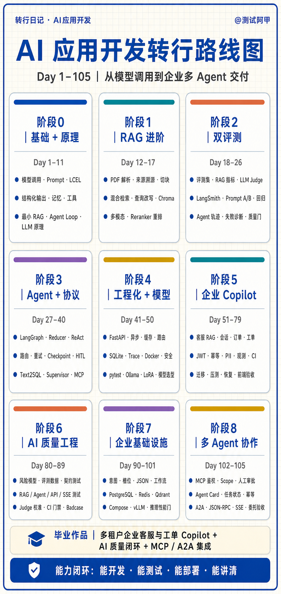

# AI 应用开发转行学习大纲（Day1–Day105）

> 适用人群：有测试/开发基础，希望转向 AI 应用开发、Agent 工程或 AI 质量工程的人。  
> 学习主线：模型调用 → RAG → 评测 → Agent → 工程化 → 企业项目 → AI 质量 → 企业基础设施 → 多 Agent 协作。  
> 最终目标：不是“学完 105 个知识点”，而是交付一套可运行、可评测、可恢复、可讲解的企业 AI 应用作品。

> 图版说明：完整版在每张阶段卡片中列出核心学习内容；另保留一张适合作为封面使用的[路线图简版](docs/assets/AI应用开发转行路线图-Day1-105.png)。

## 一、为什么从 78 天扩展到 105 天

原 Day1–Day78 已经覆盖了 AI 应用开发的基础、RAG、Agent、评测、工程化，以及一个生产导向的企业客服 Copilot。扩展后的课程不是简单追加 27 天，而是补齐三条求职时非常关键的能力链：

| 新增范围 | 补齐的能力 | 对求职的价值 |
|---|---|---|
| Day79 | 独立浏览器工作台 | 让后端能力变成可演示、可操作的完整产品 |
| Day80–Day89 | AI 自动化测试与质量闭环 | 把测试背景转化为 RAG/Agent 评测、CI 门禁和线上 badcase 的差异化优势 |
| Day90–Day101 | 企业数据与推理基础设施 | 补齐 PostgreSQL、Redis、Qdrant、Compose、vLLM 和性能门禁 |
| Day102–Day105 | MCP 鉴权与 A2A 协作 | 从单 Agent 工具调用升级为有权限、有状态、有协议的跨 Agent 集成 |

因此，105 天路线的终点已经从“能做 AI Demo”升级为“能交付企业 Agent 项目，并用测试和证据说明它为什么可信”。

## 二、105 天总路线

| 阶段 | Day | 核心主题 | 阶段验收 |
|---|---:|---|---|
| A | 1–6 | 大模型应用基础 | 完成一个有记忆、工具和结构化输出的聊天应用 |
| B | 7–17 | RAG 检索增强 | 完成可溯源、可拒答、支持混合检索与重排的 RAG |
| C | 18–26 | RAG + Agent 双评测 | 建立评测集、回归实验、轨迹评测和质量门 |
| D | 27–40 | LangGraph、Agent 与协议 | 完成带状态、路由、HITL、工具安全和多 Agent 编排的工作流 |
| E | 41–50 | 工程化与模型认知 | 把脚本服务化、容器化、可观测、可回归，并理解模型方案取舍 |
| F | 51–60 | 企业客服 Copilot 核心链 | 连续开发 RAG、会话、订单、重试、人工工单和持久化主链 |
| G | 61–70 | 生产服务与安全边界 | 补齐 API、幂等、身份、安全、观测、缓存、CI 与启动检查 |
| H | 71–79 | 交付、恢复与前端 | 完成存储迁移、容量、反馈、降级、恢复、验收和浏览器工作台 |
| I | 80–89 | AI 自动化测试专项 | 建立从风险、数据、分层测试到 CI、线上 badcase 的质量闭环 |
| J | 90–93 | 企业对话业务契约 | 用意图、槽位、稳定 JSON 和显式工作流约束客服 Agent |
| K | 94–101 | 企业数据与本地模型交付 | 接入 PostgreSQL、Redis、Qdrant、Compose、vLLM 与性能门禁 |
| L | 102–105 | MCP、A2A 与企业集成 | 完成受控工具访问和客服 Agent → 订单 Agent 的跨 Agent 验收 |

## 三、每日学习大纲

### 阶段 A｜大模型应用基础（Day1–Day6）

目标：从一次模型调用，走到一个会记忆、会调用工具、输出可被程序消费的小应用。

| Day | 主题 | 当天掌握 |
|---:|---|---|
| 1 | 第一次模型调用 | ChatModel、PromptTemplate、LCEL 管道 |
| 2 | 控制回答 | temperature、stream 流式输出 |
| 3 | 结构化输出 | Pydantic Schema、字段校验 |
| 4 | 多轮记忆 | 消息历史、上下文窗口 |
| 5 | 工具调用 | Tool Schema、参数绑定、结果回灌 |
| 6 | 聊天应用整合 | Prompt、记忆、工具和多角色消息 |

阶段作品：命令行聊天机器人。

### 阶段 B｜RAG 检索增强（Day7–Day17）

目标：让模型先查自己的资料，再基于证据回答，并能解释答案来自哪里。

| Day | 主题 | 当天掌握 |
|---:|---|---|
| 7 | 文档加载与切块 | Loader、Splitter、chunk_size、overlap |
| 8 | 向量化与检索 | Embedding、向量库、相似度检索 |
| 9 | 最小完整 RAG | 检索、上下文、生成、MMR、拒答、来源 |
| 10 | 裸 SDK 手写 RAG + Agent Loop | 理解框架封装的 harness |
| 11 | LLM 原理 | Token、Embedding、Attention、幻觉边界 |
| 12 | PDF 与来源溯源 | metadata、页码/文件证据、RAG 封装 |
| 13 | 切块策略 | 固定、递归、语义边界与 overlap 对比 |
| 14 | 混合检索 | 向量、BM25、RRF 融合 |
| 15 | 查询改写 | Multi-Query、HyDE、Context Engineering |
| 16 | 向量库持久化 | Chroma 保存、重载与复用 |
| 17 | 多模态与重排 | 图像理解、候选召回、reranker 精排 |

阶段作品：可溯源、可拒答的进阶 RAG。

### 阶段 C｜RAG + Agent 双评测（Day18–Day26）

目标：把“感觉回答不错”变成“有数据、有指标、能回归、能阻止坏版本发布”。

| Day | 主题 | 当天掌握 |
|---:|---|---|
| 18 | RAG 基础评测 | 评测样本、答案命中、忠实度与引用指标 |
| 19 | LLM-as-Judge | 正确性、忠实度、裁判不稳定性 |
| 20 | 评测集工程（上） | Schema、事实题、跨段题 |
| 21 | 评测集工程（下） | 拒答、引用、RAGAS、DeepEval |
| 22 | LangSmith 观测 | Trace、运行记录、在线评估 |
| 23 | 回归实验 | 数据集版本、baseline/candidate、回归曲线 |
| 24 | Prompt A/B | 对照实验、Judge 一致性 |
| 25 | Agent 轨迹评测 | 工具、参数、顺序、步数和结果 |
| 26 | 失败诊断与质量门 | 维度归因、阈值、趋势守护、退出码 |

阶段作品：可独立展示的 AI 评测平台与质量报告。

### 阶段 D｜LangGraph、Agent 与协议（Day27–Day40）

目标：把固定链升级成有状态、有分支、有循环、有审批和工具边界的 Agent。

| Day | 主题 | 当天掌握 |
|---:|---|---|
| 27 | LangGraph 最小图 | State、Node、Edge、START/END |
| 28 | 分支与循环 | conditional edge、循环、recursion_limit |
| 29 | State Reducer | 并发状态合并、覆盖与累加 |
| 30 | ReAct Agent | 思考、工具、观察、继续执行 |
| 31 | 节点可靠性 | 超时、有限重试、错误分类、失败出口 |
| 32 | 结构化路由 | Schema 约束的分支选择 |
| 33 | Plan-and-Execute | 计划生成、逐步执行、状态更新 |
| 34 | Agent 可观测性 | 节点日志、trace、耗时与错误定位 |
| 35 | Checkpoint 与上下文 | 状态保存、thread 恢复、上下文控制 |
| 36 | Streaming + HITL | 中间步骤流式、暂停、人工确认、恢复 |
| 37 | 搜索 Agent 与工具安全 | 白名单、参数校验、调用预算 |
| 38 | Text2SQL Agent | 结构化查询、只读与 SQL 安全 |
| 39 | Supervisor 多 Agent | 路由、专职 Agent、fan-out 与汇总 |
| 40 | MCP 工具协议 | MCP Server/Client、stdio/HTTP、A2A 初识 |

阶段作品：可恢复、可审批、可观测的 Agent 工作流。

### 阶段 E｜工程化与模型认知（Day41–Day50）

目标：把本地脚本变成可调用、可测试、可部署的工程骨架，并能做模型方案取舍。

| Day | 主题 | 当天掌握 |
|---:|---|---|
| 41 | FastAPI 服务化 | HTTP 契约、依赖注入、错误码 |
| 42 | 可靠调用 | 异步、超时、重试、fallback、成本统计 |
| 43 | 缓存与模型路由 | 质量、延迟与费用权衡 |
| 44 | SQLite 数据层 | 参数化 SQL、事务、WAL、迁移 |
| 45 | Trace + Docker | 调用轨迹、容器打包 |
| 46 | Ollama 与统一日志 | 本地推理、统一调用接口 |
| 47 | 安全 Guardrails | 注入防护、PII、密钥清理 |
| 48 | pytest 回归 | 稳定断言、fake 依赖、持续防回归 |
| 49 | LoRA 微调 | 数据、adapter、base-vs-adapter 门禁 |
| 50 | 模型方案选型 | Prompt、RAG、微调、量化、蒸馏与 Flash Attention |

阶段作品：可通过 API 和 Docker 运行、带回归测试的 AI 服务。

### 阶段 F｜企业客服 Copilot 核心链（Day51–Day60）

目标：从独立练习切换为连续开发同一个“企业客服与工单 Copilot”。

| Day | 主题 | 当天掌握 |
|---:|---|---|
| 51 | 客服 RAG 最小产品 | 分层结构、真实来源、无证据不调用模型 |
| 52 | 多文档知识库 | 稳定 source/chunk ID、目录摄取 |
| 53 | 产品链离线评测 | 真实 `ask()`、答案/引用/拒答、退出码 |
| 54 | 混合检索入主链 | Chroma + BM25 + RRF |
| 55 | 连续追问 | session、问题改写、上下文窗口、会话隔离 |
| 56 | LangGraph 客服流 | 校验、改写、检索、拒答、生成显式化 |
| 57 | 受控订单查询 | 工具分支、Repository 权限边界 |
| 58 | 工具可靠性 | 超时、错误分类、有限重试 |
| 59 | 人工升级闭环 | 无证据建工单、返回可追踪编号 |
| 60 | 会话持久化 | tenant/user/thread 三层隔离、重启恢复 |

阶段作品：有知识问答、订单工具、人工工单和持久化会话的客服 Copilot。

### 阶段 G｜生产服务与安全边界（Day61–Day70）

目标：让 Copilot 具备可信身份、写操作安全、可观测与发布门禁。

| Day | 主题 | 当天掌握 |
|---:|---|---|
| 61 | FastAPI 服务边界 | `/chat` 契约、runtime 组装、替身测试 |
| 62 | 写操作幂等 | Idempotency-Key、请求指纹、结果复用 |
| 63 | 可信身份 | JWT → Identity → 业务层 |
| 64 | 增量知识同步 | 哈希、upsert/delete/skip、失败恢复 |
| 65 | 提示词注入防护 | 用户输入与检索文档双向检查 |
| 66 | PII 脱敏 | 业务原文与脱敏日志分离 |
| 67 | 可观测性 | trace_id、阶段耗时、错误分类 |
| 68 | 安全缓存 | tenant、知识版本、问题共同组成缓存键 |
| 69 | CI 质量门 | 阈值、趋势、关键失败 fail closed |
| 70 | 容器与启动检查 | 配置校验、健康检查、readiness |

阶段作品：有身份、安全、观测和质量门的生产候选服务。

### 阶段 H｜交付、恢复与前端（Day71–Day79）

目标：补齐可迁移、可压测、可恢复、可演示和可面试讲解的交付证据。

| Day | 主题 | 当天掌握 |
|---:|---|---|
| 71 | 向量存储契约 | 适配器、迁移、pgvector 边界 |
| 72 | 容量与压测 | 并发、吞吐、p95/p99、错误率 |
| 73 | 用户反馈闭环 | 点赞/点踩、原因、trace 关联 |
| 74 | 模型供应商降级 | Provider 契约、重试错误、fallback |
| 75 | 备份与恢复 | backup、restore、核对与演练 |
| 76 | 统一业务应用 | RAG、会话、订单、工单、反馈统一入口 |
| 77 | 面试证据 | 问题、方案、验证、边界、证据索引 |
| 78 | 最终验收 | 正常与越权/故障路径 fail closed |
| 79 | Vite 前端工作台 | JWT、聊天、来源、订单、工单、反馈 |

阶段作品：可在浏览器演示的企业客服与工单 Copilot。

### 阶段 I｜AI 自动化测试专项（Day80–Day89）

目标：把传统测试经验升级为 AI 应用的质量工程能力，而不只测试“答案对不对”。

| Day | 主题 | 当天掌握 |
|---:|---|---|
| 80 | 测试策略与风险建模 | impact × likelihood、覆盖与放行规则 |
| 81 | 评测数据工程 | EvalCase Schema、版本、标签切片 |
| 82 | Mock、契约与不变量 | 离线稳定自动化、失败路径 |
| 83 | RAG 分层测试 | Recall@k、Precision@k、MRR、引用覆盖 |
| 84 | Judge 校准 | 人工标签、阈值、agreement、Cohen's kappa |
| 85 | Agent 测试 | 工具、参数、审批、步骤预算、副作用 |
| 86 | API、SSE 与 E2E | 流式顺序、鉴权、多租户、端到端结果 |
| 87 | 安全、韧性与性能 | 对抗、故障注入、重试、p95、错误率 |
| 88 | CI 分层门禁 | PR/nightly/release、flaky 防护 |
| 89 | 线上质量闭环 | badcase 去重、审核、回归集、改进复盘 |

阶段作品：AI 测试策略、分层自动化套件、质量门和线上 badcase 回流闭环。

### 阶段 J｜企业对话业务契约（Day90–Day93）

目标：把自由文本客服约束成意图明确、参数齐全、输出稳定、状态可恢复的工作流。

| Day | 主题 | 当天掌握 |
|---:|---|---|
| 90 | Few-shot 意图契约 | 枚举、少样本、未知意图处理 |
| 91 | 槽位与追问 | 参数抽取、缺参追问、跨轮槽位状态 |
| 92 | 稳定 JSON | 提取、Schema 校验、一次受控修复 |
| 93 | 显式客服工作流 | 分类、补参、执行、handoff、状态恢复 |

阶段作品：不会在意图不明或缺参时误执行副作用的客服 Agent。

### 阶段 K｜企业数据与本地模型交付（Day94–Day101）

目标：补齐真实企业数据层、缓存、向量服务、本地交付与推理容量决策。

| Day | 主题 | 当天掌握 |
|---:|---|---|
| 94 | PostgreSQL 多租户层 | Schema、事务、参数化仓储、RLS |
| 95 | 安全 Text2SQL | 查询目录、只读校验、参数绑定、EXPLAIN 门禁 |
| 96 | Redis | 租户版本缓存、失效、限流 |
| 97 | 向量库选型 | pgvector/Qdrant/Milvus、tenant filter |
| 98 | Compose + Linux | Postgres/Redis/Qdrant、健康检查、运维手册 |
| 99 | OpenAI-compatible Provider | 云 API 与本地端点的统一调用契约 |
| 100 | vLLM + GPU | 启动参数、并行度、上下文、显存与容器 Profile |
| 101 | 推理基准 | TTFT、吞吐、p95、错误率、量化与 KV Cache 决策 |

阶段作品：可本地复现、可切换模型服务、可用性能证据做发布决策的企业 AI 基础设施骨架。

### 阶段 L｜MCP、A2A 与企业集成（Day102–Day105）

目标：让不同 Agent/服务在身份、权限、状态和协议约束下安全协作。

| Day | 主题 | 当天掌握 |
|---:|---|---|
| 102 | MCP HTTP 鉴权 | audience、scope、最小权限、写工具审批 |
| 103 | A2A 任务模型 | Agent Card、状态机、messageId 幂等 |
| 104 | A2A HTTP 协议 | JSON-RPC、REST、SSE、错误映射 |
| 105 | 跨 Agent 集成 | 客服 Agent 委托订单 Agent、鉴权与失败出口 |

阶段作品：客服 Agent → 订单 Agent 的可测试企业协议集成。

## 四、转行能力与作品证据

| 目标岗位 | 重点阶段 | 应展示的证据 |
|---|---|---|
| AI 应用开发工程师 | A–H、J–L | RAG、Agent 工作流、API、数据层、部署、权限与集成验收 |
| Agent / LangGraph 工程师 | C–H、J–L | 状态图、工具安全、HITL、轨迹评测、MCP/A2A |
| AI 自动化测试 / AI 质量工程师 | C、G、I | 评测集、分层指标、Judge 校准、CI 门禁、badcase 闭环 |
| 企业 AI 解决方案 / 交付 | F–L | 多租户、安全、恢复、容量、Compose、vLLM、协议边界 |

最终作品建议统一讲成：

> 我连续开发了一套多租户企业客服与工单 Copilot。它不仅能基于企业知识回答和调用订单工具，还具备身份隔离、人工审批、评测回归、CI 质量门、反馈闭环、恢复演练、本地模型服务，以及 MCP/A2A 跨 Agent 协作边界。

## 五、学习与验收原则

1. 每天只新增一个核心能力，但必须接回真实主链，避免孤立 Demo。
2. 每个能力同时验证正常路径、非法/越权路径和依赖故障路径。
3. 概率性输出用指标、区间和 baseline 对比；确定性契约用稳定断言阻断。
4. 所有简历数字必须能回到测试、报告、trace 或基准结果。
5. Compose、本地替身和离线验收不等于生产高可用；不声称尚未完成的 Kubernetes、企业 IdP、真实 GPU 容量或远端 A2A 联调。
6. Day105 不是学习终点，而是开始按目标 JD 加深某一条主线：应用开发、Agent、AI 质量或企业交付。
