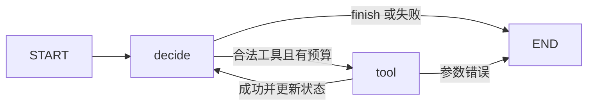

# 4.1 Agent 模式：先决定控制权放在哪里

[全书目录](../../README.md) · [上一章 3.10](../../part3-evals/3.10-eval-report-failures/README.md) · [下一章 4.2](../4.2-langgraph-basics/README.md)

- **目标**：说清固定工作流与动态工具循环的区别，看懂一个有界的 Agent 循环怎样管理状态、失败和终止。
- **前置**：1.5。
- **环境**：离线；用脚本化决策器代替模型，图由真实的 LangGraph 执行。
- **命令**：`python tools/run_chapter.py 4.1`

## 问题

步骤由代码预先确定时是工作流；下一步动作由模型根据运行结果决定时是 Agent，两种方式可以混合（[LangGraph 官方模式说明](https://docs.langchain.com/oss/python/langgraph/workflows-agents)）。选哪一种，先看任务是否需要动态决策。一旦动态，就必须回答：循环怎么停、出错怎么办、什么时候暂停等人。

## 概念

本例用脚本化的决策器代替模型，只观察控制循环，不证明模型能理解任意问题，也不把确定性脚本包装成智能 Agent。

| 边界 | 本例的定义 |
|---|---|
| 状态 | `question`、`steps`、`observations`、`decision`、`status`、`error` |
| `decide` 节点 | 读取状态，请求下一步动作，检查工具白名单和预算 |
| `tool` 节点 | 校验整数，执行无外部副作用的 `add`，追加观察并把步数加一 |
| 正常边 | START → decide → tool → decide；`finish` → END |
| 失败边 | 未知工具、参数错误、超时或预算耗尽 → `failed` → END |
| 终止条件 | `finish`、失败，或最多 `max_steps` 次工具调用 |
| 恢复边界 | 可在 `tool` 前暂停，用相同的 `thread_id` 从检查点继续 |

`observations` 每次返回新列表，节点不悄悄修改旧状态。决策器只捕获声明过的 `ValueError` 和 `TimeoutError`，意外的程序错误会向外暴露。

本章用到 `StateGraph`、条件边和检查点，它们会在 4.2、4.3、4.10 逐步讲解。现在把它们当作“描述流程图的语言”，读懂每个节点做什么、每条边怎么走即可。

## 流程

1. `fixed_workflow`：固定执行一次加法，顺序写死。
2. `scripted_planner` 首次选择 `add`，看到观察结果后选择 `finish`：正常循环得到 `[5]` 与 `done`。
3. 一个总是要求 `add` 的决策器，在 2 次工具执行后因预算耗尽得到 `failed`，不会无限循环。

## 代码导读

[agent_patterns.py](agent_patterns.py)：按 `State` → `decide` → `tool` → 条件边的顺序阅读。可以先临时返回未知动作，验证工具没有被执行；再传入错误参数，验证失败不会伪装成成功。

对应的测试：`python -m pytest chapters/test_new_lessons.py -q`。它还用 `InMemorySaver` 演示了暂停与恢复：图停在 `tool` 之前，`invoke(None, config)` 恢复后，结果只出现一次 `5`。

## 模式如何选择

- 固定步骤：先用工作流。
- 需要动态选择工具：用有界循环（4.5）。
- 可验证的多步骤任务：计划与执行（4.8）。
- 独立任务才考虑并行与 Supervisor（4.14）。

增加模式之前，先说明状态怎样汇总、错误怎样传播、什么时候终止，以及付出的延迟和成本。

## 练习

1. 运行正常规划，再让规划器重复要求执行同一个工具，观察步数上限如何终止循环。
2. 暂停在工具之前，预测恢复后会从哪里继续，再对照测试证据。
3. 把 `max_steps` 改成 1，预测结果，再运行验证。

在 [学习记录](workbook.md) 写明终止原因和测试结果。

## 运行与边界

- 规划器是确定性替身，离线实验只说明控制与恢复机制，不代表真实模型能可靠规划。
- 内存检查点不跨进程存活；有副作用的工具还需要幂等性和审批，恢复并不保证外部操作自动只执行一次。
