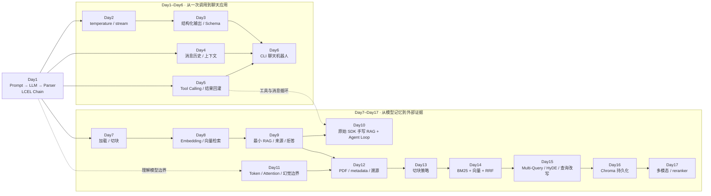
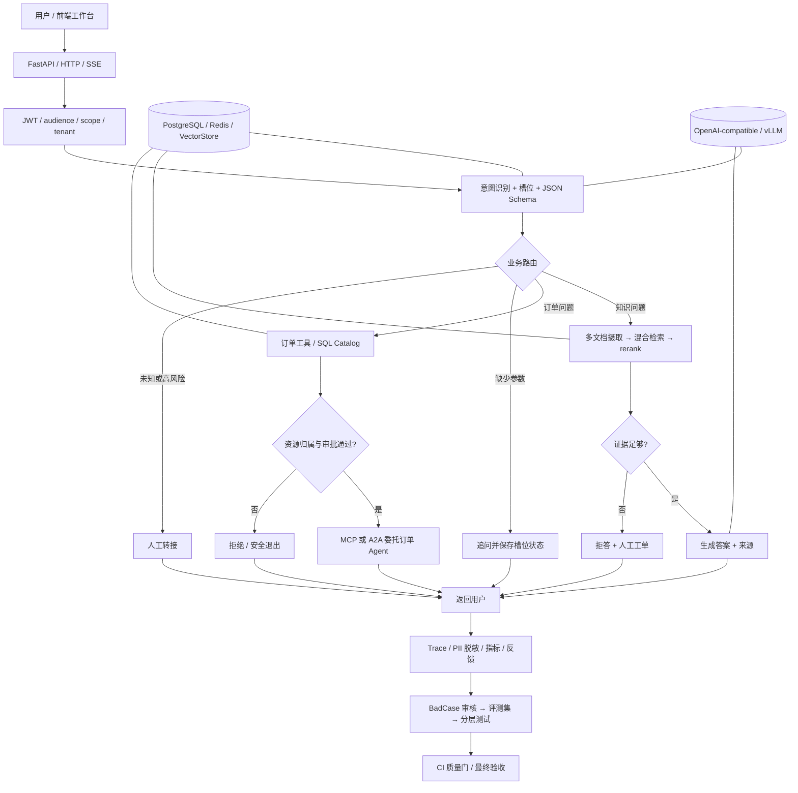

# Day1–Day105 学习清单与总知识图谱

> 核对口径：以当前仓库中的可执行源码、测试和每日 README/workbook 为准，阶段总览用于补充教学意图。下面的“阶段演进”表示课程版本的学习顺序，不等于一条用户请求的真实运行顺序。

## 一、105 天分别在讲什么

### 阶段 A：大模型应用基础（Day1–Day6）

这一段解决的是“怎么从一次模型调用，逐步做成一个会记忆、会用工具的小应用”。

| Day | 当天在讲什么 | 核心知识 / 当天产出 |
|---:|---|---|
| Day1 | 第一次和大模型对话 | ChatModel 基础调用、PromptTemplate、LCEL `prompt \| model` 管道。 |
| Day2 | 控制模型怎么回答 | temperature 控制随机性；stream 流式输出，理解稳定性与交互体验。 |
| Day3 | 把自然语言变成程序可用的数据 | Pydantic Schema、结构化输出、字段校验，让下游代码能可靠消费模型结果。 |
| Day4 | 让对话记住上文 | 多轮消息、会话历史、上下文窗口，建立最早的“状态”概念。 |
| Day5 | 让模型调用外部工具 | Tool Schema、参数绑定、tool call、工具结果回灌；模型负责选择，程序负责执行。 |
| Day6 | 综合成命令行聊天机器人 | 把 Prompt、记忆、工具和多角色消息组合成第一个完整聊天应用。 |

### 阶段 B：RAG 检索增强生成（Day7–Day17）

这一段把“只靠模型记忆回答”升级成“先查自己的资料，再基于证据回答”。

| Day | 当天在讲什么 | 核心知识 / 当天产出 |
|---:|---|---|
| Day7 | RAG 第一步：加载文档和切块 | Document Loader、Text Splitter、chunk_size / overlap；把原始资料变成可检索片段。 |
| Day8 | RAG 第二步：向量化和语义检索 | Embedding、向量库、相似度检索；把“词面匹配”升级为“语义接近”。 |
| Day9 | 串起最小完整 RAG | 检索→上下文→Prompt→生成；加入 MMR、无证据拒答和来源意识。 |
| Day10 | 不用框架手写 RAG 与 Agent Loop | 用原始 SDK 手写检索、消息循环和工具循环，理解 LangChain/LangGraph 所封装的 harness。 |
| Day11 | 了解 LLM 为什么会这样工作 | Token、Embedding、Attention、生成概率与幻觉；建立模型能力边界。 |
| Day12 | 处理真实 PDF 并保留来源 | PDF Loader、metadata、来源溯源、RAG 封装；答案能回到真实页/文件证据。 |
| Day13 | 比较不同切块策略 | 固定长度、递归切分、语义边界与 overlap；理解切块如何影响召回。 |
| Day14 | 向量检索加 BM25 混合检索 | Semantic Search + Keyword Search + RRF 融合，兼顾语义和精确业务词。 |
| Day15 | 改写用户查询 | Multi-Query、HyDE、Context Engineering；为模糊或表达不佳的问题生成更好检索入口。 |
| Day16 | 持久化向量库 | Chroma 持久化、重载与复用，避免每次启动都重新嵌入全部文档。 |
| Day17 | 多模态读图与二阶段重排 | 图像理解、候选召回、reranker 精排；形成“先广召回、再精排序”的检索链。 |

### 阶段 C：RAG 与 Agent 评测（Day18–Day26）

这一段把“看起来回答不错”升级成“有数据、有指标、能回归、能阻止坏版本发布”。

| Day | 当天在讲什么 | 核心知识 / 当天产出 |
|---:|---|---|
| Day18 | 手写 RAG 基础评测 | 建评测样本，手写答案命中、忠实度/引用等基础指标，理解指标怎么算。 |
| Day19 | 让另一个 LLM 当裁判 | LLM-as-Judge 评正确性与忠实度，同时认识裁判自身也可能不稳定。 |
| Day20 | 正式建立评测集 | Eval Schema、事实题、跨段题、期望答案/来源；把测试数据做成结构化资产。 |
| Day21 | 补齐拒答与引用评测 | 拒答、来源引用、RAGAS / DeepEval；让评测覆盖资料内与资料外问题。 |
| Day22 | 用 LangSmith 看链路 | Trace、运行记录、在线评估；从最终答案追到每一步输入输出。 |
| Day23 | 做 baseline/candidate 回归实验 | 评测集版本化、基线与候选对比、回归曲线；判断新版本到底有没有变好。 |
| Day24 | Prompt A/B 与裁判一致性 | 两版 Prompt 对照实验、Judge agreement；防止只凭单次高分选方案。 |
| Day25 | 评测 Agent 行为轨迹 | 工具名、调用顺序、参数、步数和最终答案一起验，避免“答案对但过程越权”。 |
| Day26 | 生产级失败诊断与质量门 | 按维度拆失败、生成报告、阈值判定、趋势守护；失败时用退出码阻止继续发布。 |

### 阶段 D：LangGraph、Agent 与协议（Day27–Day40）

这一段把“固定链”升级成“显式状态、条件分支、循环、工具和多 Agent 协作”。

> 口径说明：根 README 曾把 Day27 写成已并入 Day26，但当前 `day27/day27_langgraph_basics.py` 与分段总览都保留了独立课程。这里按现有源码记为“LangGraph 线性图基础”；Day28 则是分支与循环。

| Day | 当天在讲什么 | 核心知识 / 当天产出 |
|---:|---|---|
| Day27 | LangGraph 最小线性图 | State、Node、Edge、START/END；先看懂状态怎样沿节点流动。 |
| Day28 | LangGraph 分支与循环 | conditional_edges、循环、recursion_limit，并用图重写手写工具循环。 |
| Day29 | State Reducer | 并发节点更新如何合并、覆盖与累加；避免多分支写同一状态时丢数据。 |
| Day30 | ReAct Agent | “思考→工具→观察→继续”的工具循环；把 Day5/10 的机制变成框架化 Agent。 |
| Day31 | 节点可靠性 | 超时、有限重试、错误分类、降级/失败出口；让图节点不因一次抖动失控。 |
| Day32 | 结构化路由 | 用受 Schema 约束的模型输出选择分支，替代脆弱的字符串判断。 |
| Day33 | Plan-and-Execute | 先生成步骤计划，再逐步执行与更新；适合多步骤、可检查的任务。 |
| Day34 | Agent 可观测性 | 节点级日志、trace、耗时与错误定位；回答“Agent 到底卡在哪一步”。 |
| Day35 | Checkpoint 与上下文管理 | 保存图状态、按 thread 恢复、控制上下文；为暂停、续跑和多轮会话打底。 |
| Day36 | 流式中间步骤与 HITL | stream 运行进度、interrupt 暂停、人工确认后恢复高风险流程。 |
| Day37 | 搜索 Agent 与工具安全 | 工具白名单、参数校验、调用预算、搜索后总结；把“能用工具”升级为“受控使用”。 |
| Day38 | Text2SQL Agent | 自然语言→结构化查询→数据库结果；强调只读、结构校验和 SQL 安全边界。 |
| Day39 | Supervisor 多 Agent | 主管路由、专职 Agent、fan-out 并行与结果汇总；理解多 Agent 编排。 |
| Day40 | MCP 标准化工具接入 | MCP Server/Client/Agent、stdio 与 HTTP 工具边界，并初步认识 A2A。 |

### 阶段 E：服务化、可靠性与模型方案（Day41–Day50）

这一段把本地脚本补成能被调用、能测试、能部署、能做方案取舍的工程骨架。

| Day | 当天在讲什么 | 核心知识 / 当天产出 |
|---:|---|---|
| Day41 | 用 FastAPI 服务化 RAG | HTTP 输入输出模型、依赖注入、错误码与测试替身；把本地函数开放成接口。 |
| Day42 | 异步、超时、重试与成本 | 可靠调用封装、重试边界、fallback 与 token/成本统计。 |
| Day43 | 缓存与模型路由 | 相同请求复用结果；按任务复杂度在不同模型间路由，平衡质量、延迟和费用。 |
| Day44 | SQLite 业务数据层 | 参数化 SQL、事务、WAL/并发与迁移意识；把业务状态可靠落盘。 |
| Day45 | Trace 与 Docker 打包 | 运行轨迹加容器镜像，把“本机能跑”变成可复现的运行单元。 |
| Day46 | 结构化调用日志与 Ollama | 本地模型推理、统一调用接口与日志；理解云模型和本地模型的切换边界。 |
| Day47 | 安全 Guardrails | Prompt Injection、PII 脱敏、密钥清理；建立输入、输出、日志三类安全边界。 |
| Day48 | pytest 自动回归 | 把固定评测案例接进 pytest，使用稳定断言和 fake 依赖持续防回归。 |
| Day49 | 跑一次真实 LoRA 微调 | 数据格式、adapter 训练、base-vs-adapter 对比门禁；认识微调成本和适用范围。 |
| Day50 | 选择 Prompt、RAG 还是微调 | 按知识更新频率、可控性、成本和延迟做方案选择，并扫盲量化、蒸馏、Flash Attention。 |

### 阶段 F：企业客服 Copilot 核心链（Day51–Day60）

从这里开始不再是互相独立的练习，而是连续开发同一个客服与工单 Copilot。

| Day | 当天在讲什么 | 核心知识 / 当天产出 |
|---:|---|---|
| Day51 | 做出客服 RAG 最小产品 | 分离配置、建库、组装、业务和 CLI；只有检索到证据才调用模型，并返回真实来源。 |
| Day52 | 扩展为多文档知识库 | 目录摄取、稳定 source_id/chunk_id、多文件切块；底层扩展但业务入口不变。 |
| Day53 | 用正式产品链离线评测 | 评测复用真实 `ask()`，同时检查答案、引用和拒答，以退出码表达失败。 |
| Day54 | 混合检索进入主链 | Chroma + BM25 + RRF 真正接入用户问答和评测，不停留在孤立算法 Demo。 |
| Day55 | 连续追问与会话隔离 | session 历史、追问改写、有限上下文窗口；不同用户/会话不能串线。 |
| Day56 | 用 LangGraph 表达客服控制流 | 把校验、改写、检索、拒答、生成画成显式图，同时保持原 `ask()` 契约。 |
| Day57 | 增加受控订单查询工具 | 订单走结构化工具而非 RAG；在 Repository 边界检查订单归属与错误类型。 |
| Day58 | 工具超时与有限重试 | 临时错误才重试、永久错误不重试、只读操作才可安全复用调用。 |
| Day59 | 证据不足转人工工单 | 无证据时创建可追踪 ticket，返回工单号；把“拒答提示”升级成业务闭环。 |
| Day60 | SQLite 会话持久化 | tenant_id + user_id + thread_id 三层边界，重启后仍能恢复历史。 |

### 阶段 G：生产服务与安全边界（Day61–Day70）

这一段把客服主链变成可被前端调用、可控安全、可观测、可发布的服务。

| Day | 当天在讲什么 | 核心知识 / 当天产出 |
|---:|---|---|
| Day61 | 建立 FastAPI 服务边界 | `/chat` 契约、runtime 依赖组装、fake application 测试；HTTP 层复用正式业务入口。 |
| Day62 | 给写操作增加幂等 | Idempotency-Key、请求指纹、结果复用；网络重试不能重复创建工单。 |
| Day63 | 建立可信身份 | JWT 验签→Identity→业务层；不再相信请求正文自报的 user_id/tenant_id。 |
| Day64 | 增量知识同步 | 内容哈希、upsert/delete/skip 同步计划；删除旧知识和新增知识同等重要。 |
| Day65 | 防御直接与间接提示词注入 | 同时检查用户输入和检索文档；指令/数据分离、工具白名单与审计。 |
| Day66 | PII 脱敏 | 业务原文与脱敏日志副本分开，手机号/身份证等敏感信息不扩散到观测系统。 |
| Day67 | 建立可用 Trace | trace_id、租户/用户/线程边界、阶段耗时、错误分类；成功失败都有可定位证据。 |
| Day68 | 做安全缓存 | 缓存键包含 tenant、知识版本和问题；避免跨租户命中或知识更新后返回旧答案。 |
| Day69 | 把评测变成 CI 质量门 | 聚合质量指标、阈值与趋势，关键失败时 fail closed 阻止发布。 |
| Day70 | 容器化与启动检查 | Docker、配置校验、依赖健康检查、readiness；启动成功不等于服务已就绪。 |

### 阶段 H：交付、恢复与前端工作台（Day71–Day79）

这一段补齐存储迁移、容量、反馈、降级、恢复、验收和用户可见界面。

| Day | 当天在讲什么 | 核心知识 / 当天产出 |
|---:|---|---|
| Day71 | 抽象向量存储契约 | VectorStore 接口、同步适配、pgvector schema；让业务不绑定某一个向量库。 |
| Day72 | 容量评估与压测判定 | 并发、吞吐、p95/p99、错误率和发布阈值；用数据判断是否扛得住。 |
| Day73 | 用户反馈闭环 | 点赞/点踩、原因、trace 关联与反馈 API；把线上体验转成可分析数据。 |
| Day74 | 模型供应商降级 | 主/备 Provider、可重试错误分类、fallback 证据；单一模型故障不拖垮系统。 |
| Day75 | 备份与恢复验证 | 备份会话/工单等状态，执行 restore 并核对；“有备份”必须用恢复演练证明。 |
| Day76 | 收敛到统一业务应用 | RAG、会话、订单、工单、反馈等全部通过同一 application 入口，减少旁路。 |
| Day77 | 把项目变成可验证的面试证据 | 从源码、测试和证据文件说明问题、方案、验证与边界，避免只报功能名。 |
| Day78 | 毕业级最终验收 | 对答案、拒答、越权、幂等、恢复、缓存、安全和质量门做 fail-closed 验收。 |
| Day79 | Vite 前端工作台 | JWT 对接、多轮聊天、来源、订单、工单、反馈和错误状态，展示 Day78 的真实 API。 |

### 阶段 I：AI 自动化测试专项（Day80–Day89）

这一段把测试背景变成 AI 应用开发的差异化能力：从风险到数据、分层指标、CI，再回收线上坏例。

| Day | 当天在讲什么 | 核心知识 / 当天产出 |
|---:|---|---|
| Day80 | AI 测试策略与风险建模 | impact × likelihood 风险分、优先级和覆盖缺口；先决定最该测什么。 |
| Day81 | 评测集与测试数据工程 | EvalCase Schema、版本、标签切片、JSON 持久化、坏数据失败。 |
| Day82 | Mock、契约与不变量测试 | Mock 隔离外部依赖，Contract 固定接口形状，Invariant 固定关键业务关系。 |
| Day83 | RAG 分层自动化测试 | Recall@k、Precision@k、MRR、引用覆盖；分开定位召回、排序和引用问题。 |
| Day84 | 校准 LLM-as-Judge | 人工标签、阈值搜索、agreement、Cohen's kappa、混淆矩阵；先证明裁判可信。 |
| Day85 | Agent 自动化测试 | 工具白名单、参数、审批、步骤预算和副作用；轨迹本身也是产品输出。 |
| Day86 | AI API、SSE 与 E2E | HTTP 契约、SSE 顺序、token 合并、鉴权/租户、前后端最终可见结果。 |
| Day87 | 安全、韧性与性能测试 | 输入边界、故障注入、有限重试、p95 与错误率 SLO；接口能通不等于可靠。 |
| Day88 | CI 分层门禁与 flaky 防护 | unit/contract/RAG/security/performance 分层结果，必需层缺失或失败就阻断。 |
| Day89 | 线上质量反馈闭环 | BadCase 去重、人工审核、导出回归集，再进入 CI；不让未经审核的反馈污染系统。 |

### 阶段 J：企业对话业务契约（Day90–Day93）

这一段把自由文本客服升级为“意图明确、参数齐全、输出稳定、分支可恢复”的业务工作流。

| Day | 当天在讲什么 | 核心知识 / 当天产出 |
|---:|---|---|
| Day90 | Few-shot 意图契约 | 意图枚举、少样本示例、置信/未知意图处理；识别不了就拒绝执行副作用。 |
| Day91 | 槽位抽取与缺参追问 | 从请求中提取业务参数，缺少 order_id 等字段时追问，并跨轮保存槽位状态。 |
| Day92 | 大模型稳定输出 JSON | JSON 提取、Schema 校验、一次受控修复；失败后明确退出，避免无限自修。 |
| Day93 | 客服意图、槽位与人工转接工作流 | 用显式工作流串联分类、补参、执行和 handoff，状态可跨轮恢复。 |

### 阶段 K：真实数据层与本地模型交付（Day94–Day101）

这一段补齐企业数据库、缓存、向量库、Compose 和本地推理服务。

| Day | 当天在讲什么 | 核心知识 / 当天产出 |
|---:|---|---|
| Day94 | PostgreSQL 会话层与租户边界 | Schema、参数化 Repository、事务、RLS；把租户隔离下沉到数据库。 |
| Day95 | Agent 安全查询 PostgreSQL | 查询目录优先、只读 SQL 校验、参数绑定、EXPLAIN 执行计划门禁。 |
| Day96 | Redis 缓存与限流 | 租户+版本缓存键、失效、计数限流；防跨租户缓存和热点请求失控。 |
| Day97 | pgvector / Qdrant / Milvus 选型 | 用过滤、运维、规模和成本做可解释选型，并实现带 tenant filter 的 Qdrant 适配器。 |
| Day98 | Compose 与 Linux 运维 | Postgres + Redis + Qdrant Compose、健康检查、启动顺序和本地运维手册。 |
| Day99 | OpenAI-compatible Provider 契约 | 统一模型请求/响应与配置边界，让云 API 和本地模型服务可替换。 |
| Day100 | vLLM 服务与 GPU 配置 | 启动命令、tensor parallel、显存/KV Cache 参数、容器 Profile。 |
| Day101 | 推理基准与容量决策 | TTFT、吞吐、p95、质量门；用基准证据决定量化、KV Cache 和部署容量。 |

### 阶段 L：MCP、A2A 与企业集成（Day102–Day105）

最后一段把“单个 Agent 会用工具”升级为“不同 Agent/服务之间按权限和协议协作”。

| Day | 当天在讲什么 | 核心知识 / 当天产出 |
|---:|---|---|
| Day102 | MCP HTTP 鉴权与写工具审批 | audience、scope、最小权限、写操作 approval；实现 Resource Server 边界。 |
| Day103 | A2A Agent Card 与任务生命周期 | Agent 能力声明、任务状态机、幂等任务仓储；重复请求不重复执行任务。 |
| Day104 | A2A JSON-RPC / REST / SSE 边界 | 请求协议、错误映射、状态查询和事件流；区分同步接口与异步任务。 |
| Day105 | 客服 Agent 调用订单 Agent | 客服侧委托订单任务，串联鉴权、协议、状态、结果和验收，形成最终企业集成闭环。 |

## 二、把 105 天串成一张总知识图谱

### 2.1 读图起点：Day1 的 Chain 是整套课程的根

Day1 代码里的准确链路是：

```text
prompt | llm | parser
   输入      推理      输出
          ↓
        chain
```

后面 104 天不是不断换新名词，而是在这条链的不同位置增加能力：给输入补上下文和知识，给推理补工具与流程，给输出补结构和评测，再把整条链放进有身份、安全、存储、监控和协议的生产系统。

图中两种箭头含义：

- `→`：当天课程直接接着前一能力继续实现。
- `-.→`：早期知识在后面重新出现并升级，不代表两个 Day 紧挨着。

### 2.2 Day1–Day17：一条 Chain 先长出输出、记忆、工具和 RAG



这一段的扩展关系是：`Chain` 先变成会聊天、会记忆、会调用工具的应用；随后在 Prompt 前面加入“加载 → 切块 → 检索 → 上下文”，形成有来源证据的 RAG Chain。

### 2.3 Day18–Day40：给 Chain 加质量反馈，再把直线升级成 Agent 图

```mermaid
flowchart LR
    P1["承接 Day1–Day17<br/>Structured Output + Memory + Tool Loop + RAG"]

    subgraph EVAL["Day18–Day26 · 评测从感觉变成发布依据"]
        direction LR
        D18["Day18<br/>手写 RAG 指标"]
        D19["Day19<br/>LLM-as-Judge"]
        D20["Day20<br/>评测集 Schema"]
        D21["Day21<br/>拒答 / 引用 / RAGAS"]
        D22["Day22<br/>LangSmith Trace"]
        D23["Day23<br/>Baseline 回归"]
        D24["Day24<br/>Prompt A/B / Judge 一致性"]
        D25["Day25<br/>Agent 轨迹评测"]
        D26["Day26<br/>失败诊断 / 质量门"]

        D18 --> D19 --> D20 --> D21 --> D22 --> D23 --> D24 --> D25 --> D26
    end

    subgraph GRAPH["Day27–Day40 · 从线性 Chain 到有状态 Agent"]
        direction LR
        D27["Day27<br/>State / Node / Edge"]
        D28["Day28<br/>条件分支 / 循环"]
        D29["Day29<br/>Reducer / 并发合并"]
        D30["Day30<br/>ReAct Agent"]
        D31["Day31<br/>超时 / 重试 / 降级"]
        D32["Day32<br/>结构化路由"]
        D33["Day33<br/>Plan-and-Execute"]
        D34["Day34<br/>Agent Trace"]
        D35["Day35<br/>Checkpoint / 上下文"]
        D36["Day36<br/>Streaming / HITL"]
        D37["Day37<br/>安全搜索 Agent"]
        D38["Day38<br/>Text2SQL"]
        D39["Day39<br/>Supervisor / 多 Agent"]
        D40["Day40<br/>MCP 工具连接层"]

        D27 --> D28 --> D29 --> D30 --> D31 --> D32 --> D33 --> D34 --> D35 --> D36 --> D37 --> D38 --> D39 --> D40
    end

    P1 -->|"RAG 答案与证据"| D18
    P1 -->|"LCEL 线性流程"| D27
    P1 -. "Day3 Schema" .-> D32
    P1 -. "Day4 Memory" .-> D35
    P1 -. "Day5 / Day10 Tool Loop" .-> D28
    D22 -. "Trace 方法进入 Agent" .-> D34
    D25 -. "轨迹成为测试对象" .-> D34
```



这时原来的 `prompt | llm | parser` 没有消失，而是被放进 Node；Edge 决定下一步，State 携带上下文，Checkpoint 保存进度，Tool Node 执行动作，评测链持续检查答案和轨迹。

### 2.4 Day41–Day60：把能力做成服务，再收敛为连续客服产品

```mermaid
flowchart LR
    P2["承接 Day1–Day40<br/>RAG + Eval + LangGraph + Agent + MCP"]

    subgraph ENG["Day41–Day50 · 工程骨架与模型方案"]
        direction LR
        D41["Day41<br/>FastAPI 服务"]
        D42["Day42<br/>异步 / 超时 / 重试 / 成本"]
        D43["Day43<br/>缓存 / 模型路由"]
        D44["Day44<br/>SQLite / 事务"]
        D45["Day45<br/>Trace / Docker"]
        D46["Day46<br/>Ollama / 统一日志"]
        D47["Day47<br/>Injection / PII / Secret"]
        D48["Day48<br/>pytest 回归"]
        D49["Day49<br/>LoRA 微调"]
        D50["Day50<br/>Prompt / RAG / 微调选型"]

        D41 --> D42 --> D43 --> D44 --> D45 --> D46 --> D47 --> D48 --> D49 --> D50
    end

    subgraph PRODUCT["Day51–Day60 · 同一个客服 Copilot 连续演进"]
        direction LR
        D51["Day51<br/>客服 RAG MVP"]
        D52["Day52<br/>多文档知识库"]
        D53["Day53<br/>正式产品链评测"]
        D54["Day54<br/>混合检索进主链"]
        D55["Day55<br/>多轮追问 / 会话隔离"]
        D56["Day56<br/>LangGraph 客服流"]
        D57["Day57<br/>订单工具 / 归属校验"]
        D58["Day58<br/>工具有限重试"]
        D59["Day59<br/>拒答转人工工单"]
        D60["Day60<br/>SQLite 会话持久化"]

        D51 --> D52 --> D53 --> D54 --> D55 --> D56 --> D57 --> D58 --> D59 --> D60
    end

    P2 --> D41
    D50 -->|"方案知识进入真实项目"| D51
    P2 -. "Day7–17 RAG" .-> D51
    P2 -. "Day18–26 Eval" .-> D53
    P2 -. "Day27–36 State / Graph" .-> D56
    P2 -. "Day5 / 30 Tool Calling" .-> D57
```



Day51 是关键转折：此前的分散练习开始进入同一条正式业务入口，之后每一天都在上一天的客服系统上增量扩展，而不是重新写一个 Demo。

### 2.5 Day61–Day79：给客服主链补齐生产边界与用户界面

```mermaid
flowchart LR
    P3["承接 Day51–Day60<br/>可运行的多租户客服核心链"]

    subgraph PROD["Day61–Day70 · API、安全、观测与发布"]
        direction LR
        D61["Day61<br/>FastAPI /chat 契约"]
        D62["Day62<br/>Idempotency-Key"]
        D63["Day63<br/>JWT / Identity"]
        D64["Day64<br/>增量知识同步"]
        D65["Day65<br/>直接 / 间接注入防御"]
        D66["Day66<br/>PII 脱敏日志"]
        D67["Day67<br/>Trace / 阶段耗时"]
        D68["Day68<br/>租户 + 版本安全缓存"]
        D69["Day69<br/>CI 质量门"]
        D70["Day70<br/>Docker / Readiness"]

        D61 --> D62 --> D63 --> D64 --> D65 --> D66 --> D67 --> D68 --> D69 --> D70
    end

    subgraph DELIVERY["Day71–Day79 · 存储迁移、恢复、验收与前端"]
        direction LR
        D71["Day71<br/>VectorStore 契约 / pgvector"]
        D72["Day72<br/>容量 / p95 / p99"]
        D73["Day73<br/>反馈 API / Trace 关联"]
        D74["Day74<br/>Provider Fallback"]
        D75["Day75<br/>备份 / Restore 验证"]
        D76["Day76<br/>统一 Application 入口"]
        D77["Day77<br/>项目证据链"]
        D78["Day78<br/>Fail-closed 最终验收"]
        D79["Day79<br/>Vite 前端工作台"]

        D71 --> D72 --> D73 --> D74 --> D75 --> D76 --> D77 --> D78 --> D79
    end

    P3 --> D61
    D70 --> D71
    P3 -. "Day16 向量持久化" .-> D71
    P3 -. "Day19–26 / Day53 评测" .-> D69
    P3 -. "Day31 / 42 / 58 可靠性" .-> D74
    D73 -. "线上坏例入口" .-> D78
```



到 Day79，用户看到的已经不是 Chain，而是一个前端工作台；但前端背后仍然是 Day1 的输入、推理、输出链，只是外面多了 HTTP、身份、租户、安全、缓存、观测、恢复和质量门。

### 2.6 Day80–Day105：把项目变成可测试、可部署、可跨 Agent 协作的企业系统

```mermaid
flowchart LR
    P4["承接 Day1–Day79<br/>可交付客服 Copilot + Frontend + CI"]

    subgraph TEST["Day80–Day89 · AI 自动化测试闭环"]
        direction LR
        D80["Day80<br/>风险建模"]
        D81["Day81<br/>评测数据工程"]
        D82["Day82<br/>Mock / Contract / Invariant"]
        D83["Day83<br/>RAG 分层指标"]
        D84["Day84<br/>Judge 校准"]
        D85["Day85<br/>Agent 轨迹测试"]
        D86["Day86<br/>API / SSE / E2E"]
        D87["Day87<br/>安全 / 韧性 / 性能"]
        D88["Day88<br/>CI 分层门禁"]
        D89["Day89<br/>BadCase 审核回归"]

        D80 --> D81 --> D82 --> D83 --> D84 --> D85 --> D86 --> D87 --> D88 --> D89
        D89 -. "审核后的坏例回流" .-> D81
    end

    subgraph CONTRACT["Day90–Day93 · 对话变成业务契约"]
        direction LR
        D90["Day90<br/>Few-shot 意图枚举"]
        D91["Day91<br/>槽位 / 缺参追问"]
        D92["Day92<br/>JSON Schema / 一次修复"]
        D93["Day93<br/>可恢复业务工作流"]

        D90 --> D91 --> D92 --> D93
    end

    subgraph INFRA["Day94–Day101 · 真实数据层与本地推理"]
        direction LR
        D94["Day94<br/>PostgreSQL / RLS"]
        D95["Day95<br/>只读 SQL / EXPLAIN"]
        D96["Day96<br/>Redis 缓存 / 限流"]
        D97["Day97<br/>pgvector / Qdrant / Milvus"]
        D98["Day98<br/>Compose / Linux 运维"]
        D99["Day99<br/>OpenAI-compatible Provider"]
        D100["Day100<br/>vLLM / GPU / KV Cache"]
        D101["Day101<br/>TTFT / 吞吐 / 容量决策"]

        D94 --> D95 --> D96 --> D97 --> D98 --> D99 --> D100 --> D101
    end

    subgraph PROTOCOL["Day102–Day105 · MCP / A2A 企业集成"]
        direction LR
        D102["Day102<br/>MCP HTTP 鉴权 / 审批"]
        D103["Day103<br/>A2A Agent Card / 任务状态"]
        D104["Day104<br/>JSON-RPC / REST / SSE"]
        D105["Day105<br/>客服 Agent 委托订单 Agent"]

        D102 --> D103 --> D104 --> D105
    end

    P4 --> D80
    P4 --> D90
    D89 -. "测试方法约束工作流" .-> D93
    D93 --> D94
    D101 --> D102
    P4 -. "Day40 MCP 基础" .-> D102
    P4 -. "Day39 多 Agent" .-> D103
    D93 -. "客服业务入口" .-> D105
    D101 -. "数据与模型服务" .-> D105
```



最终的 Day105 不是突然出现的“高级 Agent”：它把 Day1 的 Chain、Day4 的上下文、Day5 的工具、Day7–17 的 RAG、Day18–26 的评测、Day27–40 的状态与协议，以及 Day41–101 的工程能力汇合到同一次跨 Agent 业务调用中。

### 2.7 15 条跨阶段知识链

这些链比单纯按 Day 顺序更能说明“旧知识后来升级成了什么”。

| 知识主线 | 串联关系 | 最终形成的能力 |
|---|---|---|
| Prompt 与输出契约 | Day1 Prompt → Day3 结构化输出 → Day32 结构化路由 → Day90 意图枚举 → Day92 稳定 JSON | 从“让模型回答”升级为“让模型按业务契约给程序可验证的决定”。 |
| 记忆与状态 | Day4 多轮记忆 → Day27 State → Day35 Checkpoint → Day55 会话 → Day60 持久化 → Day91 槽位状态 | 对话状态既能在一次图运行中流动，也能跨线程、重启和多轮恢复。 |
| 工具与 Agent | Day5 Tool Calling → Day10 手写 Loop → Day30 ReAct → Day37 工具安全 → Day57 订单工具 | 模型可以选择工具，但真正执行必须受参数、权限、预算和业务边界控制。 |
| RAG 数据入口 | Day7 加载切块 → Day12 来源 metadata → Day52 多文档 → Day64 增量同步 | 知识库从一次性文档 Demo 变成有稳定身份、可更新、可删除的数据管道。 |
| 检索质量 | Day8 向量检索 → Day13 切块 → Day14 混合检索 → Day17 reranker → Day54 产品接入 → Day83 分层评测 | 形成“切好→广召回→融合→精排→用指标定位”的完整检索工程。 |
| 向量存储 | Day16 Chroma → Day71 VectorStore 契约 → Day94 PostgreSQL → Day97 Qdrant/pgvector/Milvus 选型 → Day98 Compose | 从本地持久化升级为可替换、可隔离、可交付的企业向量基础设施。 |
| 评测与门禁 | Day18 手写指标 → Day20 评测集 → Day23 回归 → Day26 质量门 → Day48 pytest → Day69 CI → Day78 验收 → Day88 分层门禁 | 质量从人工感觉变成数据资产、自动回归和发布阻断机制。 |
| Judge 可信度 | Day19 LLM-as-Judge → Day24 Judge 一致性 → Day84 人工校准 | 模型裁判不再被当真值，而是一个需要阈值、偏差和一致性证据的测量工具。 |
| 可观测性与性能 | Day22 LangSmith → Day34 Agent Trace → Day45 容器/Trace → Day67 生产 Trace → Day72 压测 → Day87 SLO → Day101 推理基准 | 从“看日志”升级为能定位节点、评估容量并做发布决策的证据链。 |
| 可靠性与恢复 | Day31 节点重试 → Day42 调用可靠性 → Day58 工具重试 → Day74 Provider 降级 → Day75 备份恢复 → Day87 故障注入 | 覆盖瞬时错误、供应商故障、数据丢失和性能退化，不把所有失败都当成同一种异常。 |
| 身份与数据安全 | Day47 Guardrails → Day57 资源归属 → Day63 JWT → Day65 注入 → Day66 PII → Day68 缓存隔离 → Day94 RLS → Day102 Scope/审批 | 安全从关键词拦截扩展到身份、授权、租户、日志、缓存、数据库和协议的纵深防御。 |
| 数据库与安全查询 | Day38 Text2SQL → Day44 SQLite → Day57 Repository → Day94 PostgreSQL/RLS → Day95 只读 SQL + EXPLAIN | 自然语言查库建立在参数化、只读、租户隔离和执行计划门禁之上。 |
| 用户反馈闭环 | Day59 人工工单 → Day73 显式反馈 → Day79 前端入口 → Day89 BadCase 审核回归 | 线上问题既有人接手，也能经过人工审核回到评测集和 CI。 |
| 模型方案与部署 | Day43 模型路由 → Day46 Ollama → Day49 LoRA → Day50 方案选择 → Day99 Provider → Day100 vLLM → Day101 基准 | 能按需求选择 Prompt/RAG/微调，并用统一接口、GPU 配置和基准证据交付模型服务。 |
| 多 Agent 与协议 | Day39 Supervisor → Day40 MCP/A2A 认知 → Day102 MCP 鉴权 → Day103 A2A 任务 → Day104 HTTP/SSE → Day105 客服委托订单 Agent | 从进程内多 Agent 编排升级为跨服务、带权限、带任务状态和幂等的企业协作。 |

### 2.8 最终系统的真实运行层次

下面不是 Day 顺序，而是一个企业客服请求在最终形态中可能经过的层次；分支是互斥的，不代表每个请求都会走完所有节点。



## 三、推荐复习顺序

如果目标是“能独立讲清一个企业 AI Agent 项目”，不必机械重读 105 天，可以按下面的能力闭环复习：

1. **先复习主链**：Day1 → Day3 → Day7–9 → Day27–32 → Day41 → Day51 → Day56–61 → Day76 → Day93 → Day105。
2. **再补质量护城河**：Day18–26 → Day48 → Day53 → Day69 → Day78 → Day80–89 → Day101。
3. **再补企业安全边界**：Day47 → Day57–58 → Day62–68 → Day94–98 → Day102–104。
4. **最后补模型与部署取舍**：Day43、Day46、Day49–50、Day71–75、Day99–101。

一句话总纲：**这 105 天是在把“能调用一次大模型”逐步升级成“有证据、会用工具、能记状态、可评测、可恢复、可审计、能跨 Agent 协作的企业 AI 系统”。**
