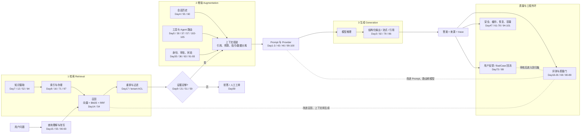

# Day1–Day105：按 RAG 三步重组的模块化学习地图

> 这份地图以当前仓库的 `docs/day01-105_knowledge_map.md`、阶段总览、每日 README/workbook 和实际代码入口为依据。它不是替换原课程阶段，而是增加一个更适合复习和讲解的 RAG 视角。

## 1. 先固定一套看 RAG 的语言

RAG 的主干只有三步，但每一步都包含多个可独立学习的模块：

```text
用户问题
  → 检索 Retrieval：知识进入索引，并从索引中召回证据
  → 增强 Augmentation：把证据、历史、规则、权限和工具结果组织成可控上下文
  → 生成 Generation：模型基于上下文回答，并输出结构化结果、引用或拒答
  → 质量 / 工程外环：评测、观测、安全、缓存、恢复、部署和反馈持续约束三步
```

这里的“增强”不只指把检索文本拼进 Prompt，也包括会话记忆、查询改写、工具路由、Agent 状态、权限判断、人工审批和跨 Agent 委托。它们共同决定“哪些信息、以什么规则、在什么时机”交给生成模型。

质量和工程不是 RAG 的第四步，而是包住三步的外环：它们回答“检索准不准、增强是否越权、生成是否可信、系统能否稳定交付”。

## 2. 12 个学习模块

| 模块 | 天数 | RAG 主落点 | 模块新增的核心修改 | 阶段产物 |
|---|---:|---|---|---|
| M0 生成基座 | Day1–6 | 生成 + 增强 | 先建立模型调用、可控输出、上下文和工具能力 | 有记忆、会用工具的聊天应用 |
| M1 检索链 | Day7–17 | 检索 | 从加载切块走到向量、混合检索、改写、持久化和重排 | 可溯源、可拒答的进阶 RAG |
| M2 质量闭环 | Day18–26 | 外环 | 给答案、引用、拒答、轨迹和版本变化加指标与质量门 | 可回归的 RAG / Agent 评测系统 |
| M3 增强与控制流 | Day27–40 | 增强 | 用图、状态、循环、路由、审批和协议组织复杂上下文 | 可恢复、可观测、受控的 Agent 工作流 |
| M4 服务化与模型方案 | Day41–50 | 三步 + 外环 | 把 RAG 变成 API、容器和可切换模型服务 | 可调用、可测试、可部署的服务骨架 |
| M5 客服 RAG 产品链 | Day51–60 | 检索 + 增强 | 在同一客服产品中接入多文档、混合检索、会话、订单、工单和持久化 | 客服与工单 Copilot 核心链 |
| M6 生产边界 | Day61–70 | 三步 + 外环 | 增加身份、幂等、增量知识、安全、Trace、缓存和 readiness | 生产候选服务 |
| M7 交付与工作台 | Day71–79 | 三步 + 外环 | 抽象向量存储、压测、反馈、降级、恢复、统一入口和前端 | 可演示、可恢复的产品工作台 |
| M8 AI 质量工程 | Day80–89 | 外环重点约束检索/增强 | 把风险、评测数据、RAG 指标、Judge、轨迹、SSE、SLO、CI 和 bad case 串起来 | AI 自动化测试与反馈闭环 |
| M9 对话业务契约 | Day90–93 | 增强 + 生成 | 用意图、槽位、稳定 JSON 和显式工作流限制业务动作 | 可恢复的客服业务工作流 |
| M10 数据与推理基础设施 | Day94–101 | 检索 + 生成 + 外环 | 真实数据库、缓存、向量服务、Compose、Provider、vLLM 和基准决策 | 可替换、可测量的企业 AI 基础设施 |
| M11 协议与跨 Agent | Day102–105 | 增强 | 将工具授权和 Agent 委托纳入协议、任务状态和集成验收 | 客服 Agent → 订单 Agent 集成 |

## 3. 每一天新增内容，具体修改了 RAG 的什么

### M0：生成基座（Day1–Day6）

这些天还没有知识库，但它们先把 RAG 最后一步“生成”以及生成前的上下文入口搭起来。

| Day | 主落点 | 当天新增 | 对 RAG 三步的修改 |
|---:|---|---|---|
| 1 | 生成 | ChatModel、PromptTemplate、LCEL `prompt \| model` | 建立最小生成链，后续所有检索证据最终都要进入这条链。 |
| 2 | 生成 | `temperature`、stream 流式输出 | 增加生成稳定性和交互输出控制，形成质量与体验的第一个旋钮。 |
| 3 | 生成 | Pydantic Schema、结构化输出、字段校验 | 让生成结果从自然语言变成下游程序可以安全消费的对象。 |
| 4 | 增强 | 多轮消息、会话历史、上下文窗口 | 在检索证据之外加入用户历史，形成“当前问题 + 上下文”的增强入口。 |
| 5 | 增强 | Tool Schema、参数绑定、tool call、结果回灌 | 让增强阶段不只读文本，还能受控地获得外部工具结果。 |
| 6 | 全链路 | CLI 聊天机器人，整合 Prompt、记忆、工具和多角色消息 | 把生成、上下文和工具组合成第一个可运行应用，为后续 RAG 挂接入口。 |

### M1：检索链（Day7–Day17）

这是第一条真正的 RAG 主干：离线把资料变成可检索对象，在线召回证据，再送入生成链。

| Day | 主落点 | 当天新增 | 对 RAG 三步的修改 |
|---:|---|---|---|
| 7 | 检索 | Document Loader、Text Splitter、`chunk_size`、`overlap` | 新增知识入口：原始文档被转换为可检索的 chunks。 |
| 8 | 检索 | Embedding、向量库、相似度检索 | 把词面查找升级为语义召回，建立第一版 Retriever。 |
| 9 | 全链路 | 最小完整 RAG、MMR、无证据拒答、来源返回 | 串起“检索 → 上下文 → Prompt → 生成”，并加上证据门和引用意识。 |
| 10 | 增强 | 原始 SDK 手写 RAG 与 Agent Loop | 把框架隐藏的检索、消息和工具循环展开，理解增强编排的真实边界。 |
| 11 | 生成 | Token、Embedding、Attention、生成概率、幻觉边界 | 解释生成模型为什么会受上下文、长度和概率影响，避免把模型当数据库。 |
| 12 | 检索 | PDF Loader、metadata、页码/文件来源溯源 | 让召回片段携带可回指原文的证据身份，生成答案可以返回真实出处。 |
| 13 | 检索 | 固定长度、递归、语义切块与 overlap 对比 | 把 chunk 策略变成可实验变量，直接影响召回粒度和上下文质量。 |
| 14 | 检索 | BM25 + 向量检索 + RRF | 用关键词和语义两路召回互补证据，再融合排序。 |
| 15 | 检索 | Multi-Query、HyDE、Context Engineering | 在召回前改写查询，弥补用户表达模糊、口语化或词汇不一致。 |
| 16 | 检索 | Chroma 持久化、重载与复用 | 把临时索引升级为可复用知识库，避免每次启动重新嵌入。 |
| 17 | 检索 | 多模态读图、候选召回、二阶段 reranker | 形成“先广召回、再精排序”的检索链，扩大证据类型并提高候选质量。 |

### M2：质量闭环（Day18–Day26）

这些天不主要增加业务功能，而是给三步增加“可测量的反馈信号”。

| Day | 主落点 | 当天新增 | 对 RAG 三步的修改 |
|---:|---|---|---|
| 18 | 质量 | 手写答案命中、忠实度、引用等基础指标 | 把“回答好不好”拆成可计算的生成和证据问题。 |
| 19 | 质量 | LLM-as-Judge，评正确性与忠实度 | 引入自动裁判，但同时暴露裁判不稳定，不能直接当真值。 |
| 20 | 质量 | Eval Schema、事实题、跨段题、期望答案/来源 | 把检索和生成的验收输入做成结构化资产。 |
| 21 | 质量 | 拒答、来源引用、RAGAS / DeepEval | 把资料内回答、资料外拒答和引用覆盖都纳入质量面。 |
| 22 | 质量 | LangSmith Trace、运行记录、在线评估 | 能从最终答案追到检索、增强和生成各环节的输入输出。 |
| 23 | 质量 | 数据集版本、baseline/candidate、回归曲线 | 用版本对比判断检索器、Prompt 或模型改动是否真的变好。 |
| 24 | 质量 | Prompt A/B、Judge agreement | 把生成 Prompt 选择从单次感觉改成对照实验和一致性判断。 |
| 25 | 增强 | Agent 工具名、顺序、参数、步数与最终答案评测 | 将增强阶段的工具轨迹也纳入产品输出，防止答案对但过程越权。 |
| 26 | 质量 | 失败维度报告、阈值、趋势守护、退出码 | 让质量问题能定位、能阻断，形成 RAG 发布前的质量门。 |

### M3：增强与控制流（Day27–Day40）

当“检索后直接生成”开始出现分支、循环和工具调用，增强阶段从一条链变成显式工作流。

| Day | 主落点 | 当天新增 | 对 RAG 三步的修改 |
|---:|---|---|---|
| 27 | 增强 | LangGraph `State`、`Node`、`Edge`、START/END | 用显式状态表达检索、判断和生成节点的输入输出。 |
| 28 | 增强 | 条件边、循环、`recursion_limit` | 允许“检索不足 → 改写/重试 → 再检索”的受控循环。 |
| 29 | 增强 | State Reducer，并发状态合并 | 规定多分支如何累加或覆盖上下文，避免证据和轨迹互相丢失。 |
| 30 | 增强 | ReAct：思考 → 工具 → 观察 → 继续 | 把检索、工具和生成组合为可循环的 Agent 增强路径。 |
| 31 | 增强 | 超时、有限重试、错误分类、降级出口 | 给增强节点增加故障边界，避免一次依赖抖动拖垮问答。 |
| 32 | 增强 | Schema 约束的结构化路由 | 用可靠的路由结果决定走知识检索、工具查询还是人工路径。 |
| 33 | 增强 | Plan-and-Execute、计划生成和逐步更新 | 让多步骤增强任务可检查、可恢复，而非一次性把所有事情塞给模型。 |
| 34 | 质量 | 节点日志、trace、耗时与错误定位 | 把增强工作流内部的瓶颈暴露出来，而不是只看最终答案。 |
| 35 | 增强 | Checkpoint、thread 恢复、上下文管理 | 给长流程和多轮问答增加可保存、可续跑的状态。 |
| 36 | 增强 | 流式中间步骤、interrupt、人工确认后恢复 | 对高风险增强动作加入 HITL，让生成前的关键决策可被人拦截。 |
| 37 | 增强 | 搜索 Agent、工具白名单、参数校验、调用预算 | 限制增强阶段能调用什么、传什么参数、最多调用几次。 |
| 38 | 增强 | Text2SQL、结构化查询、只读与 SQL 安全边界 | 把“查数据库”作为受控工具分支，而不是把所有业务数据塞进 RAG 文档。 |
| 39 | 增强 | Supervisor、专职 Agent、fan-out 与结果汇总 | 让多个增强 Agent 协作，再把结果合并回统一生成上下文。 |
| 40 | 增强 | MCP Server/Client、stdio/HTTP 工具边界 | 将工具增强从本地函数提升为标准协议接入。 |

### M4：服务化与模型方案（Day41–Day50）

这里的重点是把三步放进一个能被调用、测试、部署和切换的运行单元。

| Day | 主落点 | 当天新增 | 对 RAG 三步的修改 |
|---:|---|---|---|
| 41 | 工程 | FastAPI、HTTP 输入输出、依赖注入、错误码 | 把 RAG 从脚本变成稳定 API，固定外部调用边界。 |
| 42 | 工程 | 异步、超时、重试、fallback、token/成本统计 | 给检索和生成依赖增加可靠性和成本预算。 |
| 43 | 生成 | 缓存、模型路由、质量/延迟/费用权衡 | 同一请求可复用结果，复杂任务再选择更强生成模型。 |
| 44 | 工程 | SQLite、参数化 SQL、事务、WAL、迁移意识 | 为会话、工单和业务状态提供持久化，不把状态混进 Prompt。 |
| 45 | 工程 | Trace 与 Docker 打包 | 让三步的运行证据可追踪，并形成可复现运行单元。 |
| 46 | 生成 | Ollama、本地推理、统一调用接口和结构化日志 | 让生成模型可以在云端与本地方案之间切换。 |
| 47 | 增强 | Prompt Injection、PII 脱敏、密钥清理 | 在用户输入、检索内容、工具调用和日志之间建立安全边界。 |
| 48 | 质量 | pytest、稳定断言、fake 依赖、自动回归 | 把固定 RAG 行为接入可重复的测试命令。 |
| 49 | 生成 | 数据格式、LoRA adapter、base-vs-adapter 对比门禁 | 用微调改变生成能力，但仍需与 RAG 的知识更新问题区分。 |
| 50 | 全链路 | Prompt、RAG、微调的方案选择，量化/蒸馏/Flash Attention 扫盲 | 建立“知识变化优先 RAG、行为变化再考虑微调”的决策边界。 |

### M5：客服 RAG 产品链（Day51–Day60）

从这里开始，Day51–Day78 围绕同一个多租户企业客服与工单 Copilot 连续演进。新增模块必须接回正式 `application` 主链，而不是停留在孤立 Demo。

| Day | 主落点 | 当天新增 | 对 RAG 三步的修改 |
|---:|---|---|---|
| 51 | 全链路 | 配置、知识库、组装、业务入口和 CLI；有证据才调用模型并返回来源 | 建立可自由提问的客服 RAG MVP，固定检索、证据门、生成和来源返回的主链。 |
| 52 | 检索 | 目录摄取，多文档 `source_id` / `chunk_id` | 把单 FAQ 知识库扩成可稳定摄取、可追溯的多文档索引。 |
| 53 | 质量 | 正式 `assistant.ask()`、答案/引用/拒答评测和退出码 | 评测复用真实产品链，不复制第二套问答逻辑。 |
| 54 | 检索 | Chroma + BM25 + RRF 真正进入 `build_retriever` | 将 Day14 的混合检索从算法 Demo 改成正式产品默认路径。 |
| 55 | 增强 | session 历史、追问改写、上下文窗口和会话隔离 | 让“那发票呢”能带着正确历史进入检索与生成，且不同会话不串线。 |
| 56 | 增强 | LangGraph 客服流：校验、改写、检索、拒答、生成 | 把客服主链的分支显式化，同时保持原 `ask()` 业务契约。 |
| 57 | 增强 | 受控订单查询工具、Repository 归属检查 | 把实时订单从知识检索中分流到带身份校验的结构化工具。 |
| 58 | 增强 | 工具超时、临时/永久错误分类、有限重试 | 给订单工具增加可复用的故障策略，只对安全的只读调用重试。 |
| 59 | 增强 | 无证据建可追踪工单并返回 `ticket_id` | 将“拒答”升级为业务闭环：证据不足时不编答案，而是转人工。 |
| 60 | 增强 | `tenant_id + user_id + thread_id` 的 SQLite 会话持久化 | 让增强上下文跨重启恢复，并明确租户、用户和线程边界。 |

### M6：生产边界（Day61–Day70）

这一组不是新增 RAG 算法，而是给三步加上可被真实服务接受的身份、安全、观测和发布边界。

| Day | 主落点 | 当天新增 | 对 RAG 三步的修改 |
|---:|---|---|---|
| 61 | 工程 | `/chat` 契约、runtime 依赖组装、fake application 测试 | 让正式 RAG 入口可以被 HTTP 层调用，且测试不依赖真实上游。 |
| 62 | 增强 | `Idempotency-Key`、请求指纹、写结果复用 | 防止网络重试重复创建工单等增强阶段副作用。 |
| 63 | 增强 | JWT 验签 → Identity → 业务层 | 不再相信正文自报的用户/租户，将身份作为检索过滤和工具授权的可信输入。 |
| 64 | 检索 | 内容哈希、upsert/delete/skip 增量同步 | 让知识库可更新、可删除，旧知识不会因为只做新增而残留。 |
| 65 | 增强 | 用户输入与检索文档双向注入防护、指令/数据分离、审计 | 防止不可信用户文本或不可信文档劫持生成和工具路由。 |
| 66 | 工程 | 业务原文与脱敏日志副本分离，手机号/身份证等 PII 保护 | 让生成上下文可以按业务需要使用原文，但观测系统只接收最小必要信息。 |
| 67 | 质量 | `trace_id`、租户/用户/线程边界、阶段耗时、错误分类 | 可以分别定位检索、增强和生成各阶段的成功与失败证据。 |
| 68 | 检索 | tenant、知识版本、问题组成安全缓存键 | 避免跨租户命中、身份变化后复用旧结果，缓存不再破坏检索正确性。 |
| 69 | 质量 | 聚合质量指标、阈值、趋势与 fail-closed CI 门禁 | 将评测结果变成发布条件，坏的 RAG 版本不能继续流入部署。 |
| 70 | 工程 | Docker、配置校验、依赖健康检查、readiness | 把“进程启动”与“RAG 依赖真正就绪”区分开。 |

### M7：交付与工作台（Day71–Day79）

这些天把已经可用的三步改造成可迁移、可压测、可恢复、可演示的产品能力。

| Day | 主落点 | 当天新增 | 对 RAG 三步的修改 |
|---:|---|---|---|
| 71 | 检索 | `VectorStore` 契约、同步适配、pgvector schema 边界 | 让业务不绑定 Chroma，检索后端可以按容量和运维要求替换。 |
| 72 | 质量 | 并发、吞吐、p95/p99、错误率和发布阈值 | 判断检索/生成链在目标负载下是否可用，而不是只看单次成功。 |
| 73 | 质量 | 点赞/点踩、原因、trace 关联和反馈 API | 将用户对答案、引用和拒答的体验反馈回三步质量数据。 |
| 74 | 生成 | 主/备 Provider、可重试错误分类、fallback 证据 | 生成供应商故障时仍可按证据和降级规则返回可解释结果。 |
| 75 | 工程 | 会话/工单备份、restore 与核对演练 | 确保增强状态丢失后可以恢复，备份从口号变成验证过的流程。 |
| 76 | 全链路 | RAG、会话、订单、工单、反馈统一 application 入口 | 收敛旁路，保证前端、评测和生产 API 调用的是同一条真实主链。 |
| 77 | 质量 | 源码、测试、报告和边界组成可追溯证据 | 让别人能解释三步怎么工作、如何验证、哪些能力尚未完成。 |
| 78 | 质量 | 正常、拒答、越权、故障、幂等、恢复、安全和质量门最终验收 | 将 RAG 系统的正向路径与失败路径一起作为发布标准。 |
| 79 | 全链路 | Vite 浏览器工作台：JWT、多轮聊天、来源、订单、工单、反馈 | 把检索证据、增强分支和生成答案变成用户可直接观察和操作的界面。 |

### M8：AI 质量工程（Day80–Day89）

这一组把“测试背景”转成 RAG/Agent 的分层质量工程能力，重点是定位三步到底是哪一层出了问题。

| Day | 主落点 | 当天新增 | 对 RAG 三步的修改 |
|---:|---|---|---|
| 80 | 质量 | `impact × likelihood` 风险分、优先级和覆盖缺口 | 先决定最值得测的检索、增强和生成风险，而不是平均用力。 |
| 81 | 质量 | `EvalCase` Schema、版本、标签切片、JSON 持久化和坏数据失败 | 让评测输入可版本化、可筛选、可回放。 |
| 82 | 质量 | Mock、Contract、Invariant 测试 | 固定输出结构和业务关系，隔离外部模型/向量库波动。 |
| 83 | 检索 | Recall@k、Precision@k、MRR、引用覆盖率 | 将“召回错、排序错、引用缺”从生成质量中拆出来单独定位。 |
| 84 | 质量 | 人工标签、阈值搜索、agreement、Cohen's kappa、混淆矩阵 | 先证明 Judge 和人工判断一致，才允许自动质量分数影响门禁。 |
| 85 | 增强 | 工具白名单、参数、审批、步骤预算、副作用轨迹 | 把 Agent 的增强过程当作产品输出进行测试。 |
| 86 | 工程 | HTTP 契约、SSE 顺序、token 合并、鉴权/租户和 E2E | 验证三步结果经过网络和前端后仍按用户实际收到的顺序呈现。 |
| 87 | 工程 | 输入边界、故障注入、有限重试、p95 和错误率 SLO | 把安全、韧性和性能预算一起放到 RAG 运行边界。 |
| 88 | 质量 | unit/contract/RAG/security/performance 分层结果和 flaky 防护 | 让必需层缺失或失败时 fail closed，避免偶发失败被静默掩盖。 |
| 89 | 质量 | BadCase 去重、人工审核、批准后导出回归集 | 将线上坏答案回流到评测，再由 CI 保护后续版本。 |

### M9：对话业务契约（Day90–Day93）

这组在 RAG 前增加业务理解与参数边界，避免“检索和生成都成功，但根本不该执行这个动作”。

| Day | 主落点 | 当天新增 | 对 RAG 三步的修改 |
|---:|---|---|---|
| 90 | 增强 | 有限意图枚举、few-shot 示例、`unknown` 处理 | 在进入检索、工具或生成前先判断请求属于哪条业务路径。 |
| 91 | 增强 | 订单号等槽位抽取、槽位合并、缺参追问和跨轮保存 | 把生成前的必要参数显式化，不让模型猜缺失条件。 |
| 92 | 生成 | fenced JSON 提取、Schema 校验、一次受控修复 | 给生成结果加严格边界，格式错误时有限修复，失败就明确降级。 |
| 93 | 增强 | 分类、补参、执行、handoff 的会话状态机 | 只有意图明确且槽位齐全时才进入订单、退款或知识库能力。 |

### M10：数据与推理基础设施（Day94–Day101）

这些天让检索数据层和生成模型层从本地替身走向企业可替换的基础设施。

| Day | 主落点 | 当天新增 | 对 RAG 三步的修改 |
|---:|---|---|---|
| 94 | 工程 | PostgreSQL 会话 schema、参数化 Repository、RLS 多租户 | 将增强上下文的租户隔离下沉到数据库，而不是只靠 Prompt 约定。 |
| 95 | 增强 | 查询目录优先、只读 SQL 校验、参数绑定、EXPLAIN 计划门禁 | 让结构化数据工具与 RAG 并存，但不能让 Agent 任意执行 SQL。 |
| 96 | 工程 | Redis TTL 缓存、版本失效、固定窗口限流 | 加速三步，同时阻止旧知识、旧身份和热点请求破坏结果。 |
| 97 | 检索 | pgvector/Qdrant/Milvus 选型规则、带 tenant filter 的 Qdrant 适配器 | 将向量检索从实现细节提升为可审查的容量、过滤与运维决策。 |
| 98 | 工程 | Postgres + Redis + Qdrant Compose、健康检查和运维手册 | 把检索数据层、缓存层和会话层固定为可复现本地交付单元。 |
| 99 | 生成 | OpenAI-compatible Provider 配置与统一调用契约 | 让客服工作流不绑定云 API、Ollama 或 vLLM 的具体 SDK。 |
| 100 | 生成 | vLLM `serve` 参数、GPU 并行、显存和可选 Compose profile | 将生成模型服务纳入可配置的自托管运行环境。 |
| 101 | 生成 | TTFT、吞吐、p95、质量门、量化与 KV Cache 决策 | 先过 RAG/客服质量回归，再用性能证据决定推理容量和优化。 |

### M11：协议与跨 Agent（Day102–Day105）

最后四天不是另造一套 RAG，而是把增强阶段的工具和委托能力提升到企业协议边界。

| Day | 主落点 | 当天新增 | 对 RAG 三步的修改 |
|---:|---|---|---|
| 102 | 增强 | MCP HTTP token audience、scope、最小权限、写工具审批 | 让生成前的工具增强必须经过协议级授权和审计。 |
| 103 | 增强 | Agent Card、Task 状态机、任务仓储、messageId 幂等 | 把跨 Agent 增强从函数调用改成有能力声明、有状态的任务。 |
| 104 | 增强 | A2A JSON-RPC、REST、SSE、错误映射和状态查询 | 为异步增强任务定义提交、查询、取消和流式事件的边界。 |
| 105 | 全链路 | 客服 Agent 提取订单号，委托订单 Agent，鉴权、状态、结果和验收 | 形成最终闭环：客服生成不是凭空回答，而是基于 RAG 证据或受控 Agent 结果回答。 |

## 4. 用一张图讲清楚最终系统



## 5. 建议的学习顺序

1. 先用 Day1–6 读懂“生成基座”：模型为什么需要 Prompt、结构化输出、历史和工具。
2. 再用 Day7–17 只盯检索链：加载/切块 → 向量 → 混合 → 改写 → 持久化 → 重排。
3. 用 Day9、Day51、Day76 各做一次完整链路复盘：最小 RAG → 客服 RAG → 统一业务应用。
4. 读 Day18–26 和 Day80–89，学会定位“是召回错、上下文错、模型错，还是接口/工程错”。
5. 最后把 Day27–50、Day61–105 当成增强和外环：状态、工具、安全、数据、模型服务和协议都要回到三步主干上。

一句话记忆：**检索决定拿什么证据，增强决定把什么交给模型，生成决定如何表达答案；质量和工程决定这三步是否可信、可控、可持续。**

